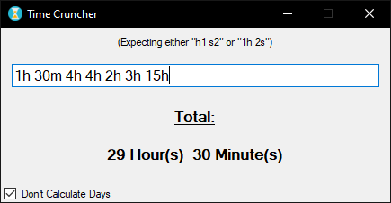

# SimpleTimeCruncher
Streamlines the process of counting the hours of each day and come up with a sum.

Example: `1h 30m 4h 4h 2h 3h 15h` outputs `29 hours 30 minutes`

### Note:
There's also an option to calculate days, so '24h' would count as 1 day in the results.

## Example:
